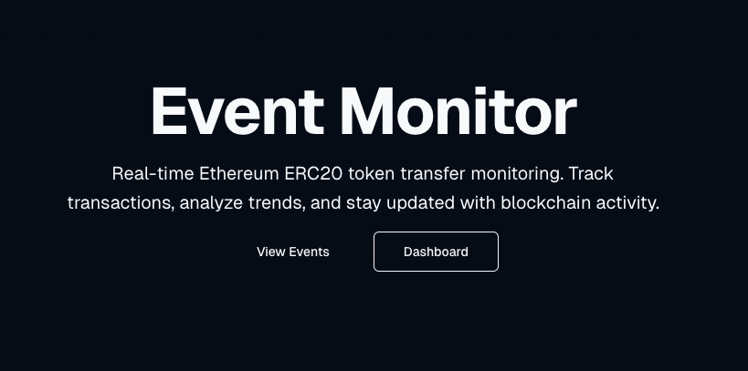
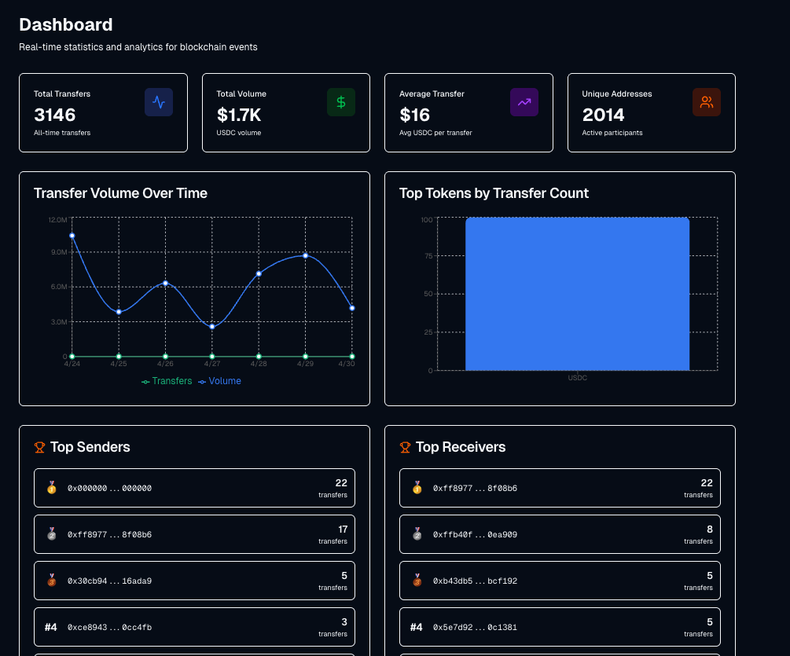
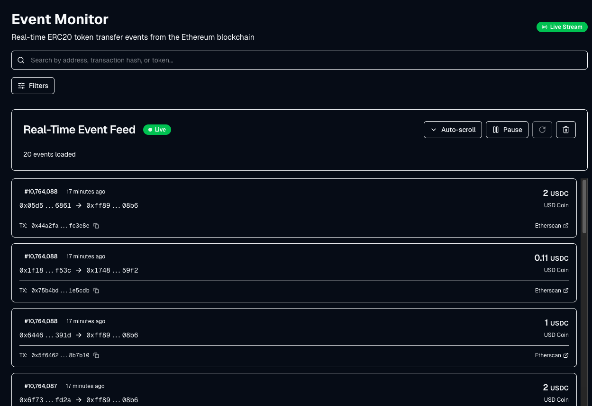

# Smart Contract Event Monitor

A full-stack application that monitors Ethereum blockchain events in real-time. The backend (Spring Boot) captures ERC20 Transfer events via WebSocket, stores them in PostgreSQL, and exposes them via REST API and Server-Sent Events. The frontend (Next.js) provides a real-time dashboard with analytics, address lookup, and live event streaming.

## Screenshots

### Home Page


### Dashboard


### Real-Time Event Feed


## Architecture

```
                    ┌─────────────────┐
                    │  Ethereum Node  │
                    │ (Infura/Alchemy)│
                    └────────┬────────┘
                             │ WebSocket
                             │
┌────────────────────────────▼─────────────────────────────┐
│                   Backend (Spring Boot)                   │
│                                                          │
│  Event Listener ──► PostgreSQL ──► REST API              │
│       │                              │                   │
│       └──────────────────────────► SSE Stream             │
│                                      │                   │
│  Prometheus Metrics ──► /actuator/prometheus              │
└──────────────┬───────────────────────┬───────────────────┘
               │ :8080                 │ :8080
               │                       │
┌──────────────▼───────────────────────▼───────────────────┐
│                  Dashboard (Next.js)                      │
│                                                          │
│  React Query ────► Historical events & stats             │
│  EventSource ────► Real-time transfer streaming          │
│  Recharts    ────► Volume charts & analytics             │
└──────────────────────────────────────────────────────────┘
               :3000
```

## Features

### Backend
- Real-time ERC20 Transfer event monitoring via WebSocket (web3j)
- Persistent storage in PostgreSQL with optimized indexes
- REST API with pagination, filtering, and sorting
- SSE streaming for real-time event delivery to clients
- Prometheus metrics and Grafana dashboards
- OpenAPI/Swagger documentation
- Kubernetes-ready with health checks

### Dashboard
- Real-time event feed with SSE auto-reconnect
- Statistics dashboard with volume charts, top senders/receivers
- Address lookup with transfer history
- Search and filtering by address, token, amount, date
- Dark/light theme with system preference detection
- Kubernetes-ready with Dockerfile and k8s manifests

## Technology Stack

| Layer | Technology |
|-------|-----------|
| Backend | Java 21, Spring Boot 3.2.x, Gradle (Kotlin DSL) |
| Web3 | web3j 4.12.0 |
| Database | PostgreSQL 16, Spring Data JPA, Flyway |
| Frontend | Next.js 16, React 19, TypeScript |
| UI | Tailwind CSS, Recharts, Lucide icons |
| Data Fetching | @tanstack/react-query, Axios, EventSource (SSE) |
| Monitoring | Prometheus, Micrometer, Grafana |
| Deployment | Docker, Kubernetes |

## Quick Start (Docker Compose)

The fastest way to run the full stack:

```bash
# Clone the repo
git clone https://github.com/zhangyi667/event-monitor.git
cd event-monitor

# Set your Ethereum node WebSocket URL
export WEB3J_CLIENT_ADDRESS="wss://sepolia.infura.io/ws/v3/YOUR_PROJECT_ID"
export CONTRACT_ADDRESS="0xYourContractAddress"

# Start everything
docker-compose up
```

This starts:
- **PostgreSQL** on port 5432
- **Backend API** on port 30081
- **Dashboard** on port 3000

Open http://localhost:3000 to view the dashboard.

## Project Structure

```
event-monitor/
├── docker-compose.yml              # One-command full-stack startup
├── Dockerfile                      # Backend container image
├── build.gradle.kts                # Backend build configuration
├── src/main/java/com/web3/eventmonitor/
│   ├── EventMonitorApplication.java
│   ├── config/                     # Web3j, Async, Metrics config
│   ├── model/                      # JPA entities and DTOs
│   ├── repository/                 # Spring Data repositories
│   ├── service/                    # Event listener, query, broadcast
│   └── controller/                 # REST and SSE endpoints
├── src/main/resources/
│   ├── application.yml             # Spring Boot configuration
│   └── db/migration/               # Flyway migrations
├── k8s/                            # Backend Kubernetes manifests
│   ├── postgres/
│   ├── app/
│   └── prometheus/
├── dashboard/                      # Next.js frontend
│   ├── Dockerfile                  # Dashboard container image
│   ├── package.json
│   ├── src/
│   │   ├── app/                    # Next.js App Router pages
│   │   ├── components/             # React components
│   │   ├── hooks/                  # Custom hooks (SSE, filters)
│   │   ├── lib/                    # API client, utilities
│   │   └── types/                  # TypeScript interfaces
│   └── k8s/                        # Dashboard Kubernetes manifests
├── home_page.png                   # Screenshots
├── dashboard.png
└── events.png
```

## Prerequisites

- Java 21
- Node.js 20+
- PostgreSQL 16
- Docker & Docker Compose
- Infura or Alchemy account (for Ethereum node access)

## Local Development (Without Docker)

### Backend

```bash
# Start PostgreSQL
docker run -d --name event-monitor-postgres \
  -p 5432:5432 \
  -e POSTGRES_DB=eventmonitor \
  -e POSTGRES_PASSWORD=postgres \
  postgres:16-alpine

# Set environment variables
export DATABASE_URL="jdbc:postgresql://localhost:5432/eventmonitor"
export DATABASE_USER="postgres"
export DATABASE_PASSWORD="postgres"
export WEB3J_CLIENT_ADDRESS="wss://sepolia.infura.io/ws/v3/YOUR_PROJECT_ID"
export CONTRACT_ADDRESS="0xYourContractAddress"

# Build and run
./gradlew bootRun
```

Backend available at http://localhost:8080

### Dashboard

```bash
cd dashboard

# Install dependencies
npm install

# Configure environment
cp .env.example .env.local
# Edit .env.local — set NEXT_PUBLIC_API_URL to your backend URL

# Start dev server
npm run dev
```

Dashboard available at http://localhost:3000

## API Endpoints

### Events

| Method | Endpoint | Description |
|--------|----------|-------------|
| GET | `/api/events` | Get all events (paginated) |
| GET | `/api/events/address/{address}` | Get events by address (from OR to) |
| GET | `/api/events/from/{fromAddress}` | Get events sent from address |
| GET | `/api/events/to/{toAddress}` | Get events received by address |
| GET | `/api/events/contract/{contractAddress}` | Get events from contract |
| GET | `/api/events/blocks?startBlock={n}&endBlock={m}` | Get events by block range |
| GET | `/api/events/stats` | Get event statistics |

### Real-Time Streaming (SSE)

| Method | Endpoint | Description |
|--------|----------|-------------|
| GET | `/api/events/stream` | Stream all events in real-time |
| GET | `/api/events/stream/address/{address}` | Stream events for specific address |
| GET | `/api/events/stream/contract/{contractAddress}` | Stream events from specific contract |

### Health

| Method | Endpoint | Description |
|--------|----------|-------------|
| GET | `/health/live` | Liveness probe |
| GET | `/health/ready` | Readiness probe |

### Query Parameters

- `page`: Page number (0-indexed, default: 0)
- `size`: Page size (default: 50)
- `sortBy`: Sort field and direction (e.g., `blockNumber,desc`)

## Kubernetes Deployment

### Deploy Backend

```bash
# Create namespace
kubectl apply -f k8s/namespace.yml

# Create ConfigMap and Secrets
kubectl apply -f k8s/configmap.yml
cp k8s/secret.yml.example k8s/secret.yml  # Edit with your values
kubectl apply -f k8s/secret.yml

# Deploy PostgreSQL
kubectl apply -f k8s/postgres/
kubectl wait --for=condition=ready pod -l app=postgres -n event-monitor --timeout=120s

# Deploy backend
kubectl apply -f k8s/app/

# Deploy Prometheus (optional)
kubectl apply -f k8s/prometheus/
```

### Deploy Dashboard

```bash
# Build dashboard image
docker build -t event-monitor-dashboard:latest ./dashboard

# Load into cluster (minikube)
minikube image load event-monitor-dashboard:latest

# Deploy
kubectl apply -f dashboard/k8s/deployment.yml
kubectl apply -f dashboard/k8s/service.yml
```

### Verify

```bash
# Check all pods
kubectl get pods -n event-monitor

# Port-forward backend
kubectl port-forward svc/event-monitor-service 8080:8080 -n event-monitor

# Port-forward dashboard
kubectl port-forward svc/event-monitor-dashboard-service 3000:3000 -n event-monitor
```

## Prometheus Monitoring

The backend exposes custom metrics at `/actuator/prometheus`:

| Metric | Type | Description |
|--------|------|-------------|
| `events_captured_total` | Counter | Total blockchain events received |
| `events_saved_total` | Counter | Events successfully saved |
| `events_duplicates_total` | Counter | Duplicate events skipped |
| `events_errors_total` | Counter | Event processing errors |
| `events_processing_duration_seconds` | Timer | Event processing time |
| `web3j_connection_status` | Gauge | WebSocket connection status |
| `sse_connections_active` | Gauge | Active SSE connections |

See [PROMETHEUS_GUIDE.md](PROMETHEUS_GUIDE.md) for detailed setup and Grafana dashboards.

## Configuration

### Backend (Environment Variables)

| Variable | Default | Description |
|----------|---------|-------------|
| `DATABASE_URL` | `jdbc:postgresql://localhost:5432/eventmonitor` | Database URL |
| `DATABASE_USER` | `postgres` | Database user |
| `DATABASE_PASSWORD` | `postgres` | Database password |
| `WEB3J_CLIENT_ADDRESS` | - | Ethereum node WebSocket URL |
| `CONTRACT_ADDRESS` | - | ERC20 contract to monitor |
| `START_BLOCK` | `latest` | Starting block number |

### Dashboard (Environment Variables)

| Variable | Default | Description |
|----------|---------|-------------|
| `NEXT_PUBLIC_API_URL` | `http://localhost:30081/api` | Backend API base URL |
| `NEXT_PUBLIC_SSE_URL` | `http://localhost:30081/api/events/stream` | SSE stream endpoint |

## Database Schema

**transfer_events table:**

| Column | Type | Description |
|--------|------|-------------|
| id | UUID | Primary key |
| contract_address | VARCHAR(42) | Contract that emitted the event |
| from_address | VARCHAR(42) | Sender address |
| to_address | VARCHAR(42) | Receiver address |
| value | NUMERIC(78,0) | Token amount transferred |
| transaction_hash | VARCHAR(66) | Transaction hash (unique) |
| block_number | BIGINT | Block number |
| block_timestamp | TIMESTAMP | Block timestamp |
| created_at | TIMESTAMP | Record creation time |

## Troubleshooting

### Backend won't start
1. Check Java version: `java --version` (must be 21)
2. Verify PostgreSQL is running: `docker ps`
3. Check environment variables are set
4. Review logs: `./gradlew bootRun --stacktrace`

### Dashboard won't connect to backend
1. Verify backend is running and healthy: `curl http://localhost:8080/health/ready`
2. Check `NEXT_PUBLIC_API_URL` points to the correct backend URL
3. Ensure CORS is configured if running on different hosts

### No events being captured
1. Check WebSocket connection in backend logs
2. Verify contract address is correct
3. Ensure there are actual Transfer events on the contract

## Development

```bash
# Backend tests
./gradlew test

# Dashboard tests
cd dashboard && npm test

# Dashboard lint
cd dashboard && npm run lint
```

## License

MIT License

## References

- [Spring Boot](https://spring.io/projects/spring-boot)
- [web3j](https://docs.web3j.io/)
- [Next.js](https://nextjs.org/docs)
- [Ethereum JSON-RPC API](https://ethereum.org/en/developers/docs/apis/json-rpc/)
- [ERC20 Token Standard](https://eips.ethereum.org/EIPS/eip-20)
- [Kubernetes](https://kubernetes.io/docs/)
- [Prometheus](https://prometheus.io/docs/)
